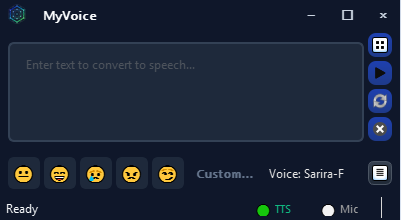
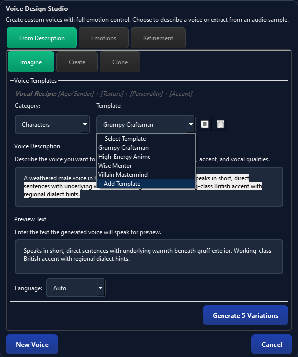
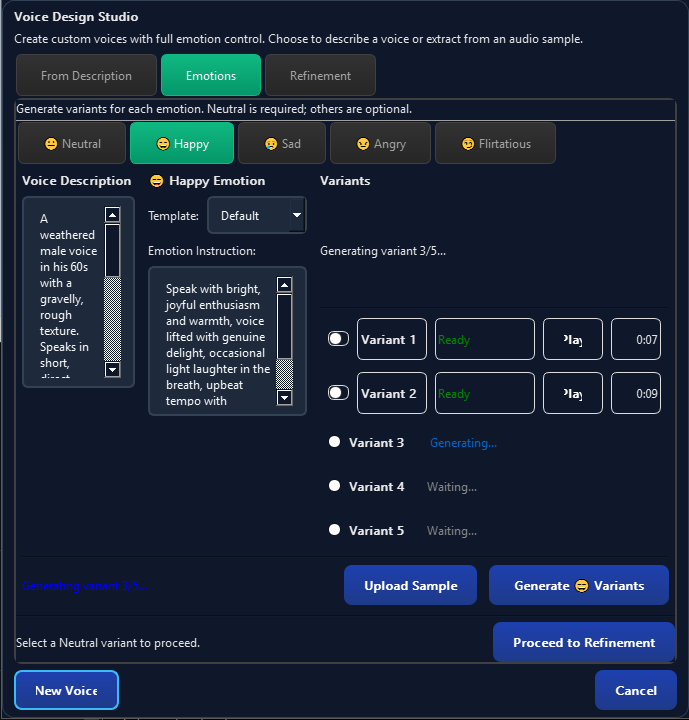
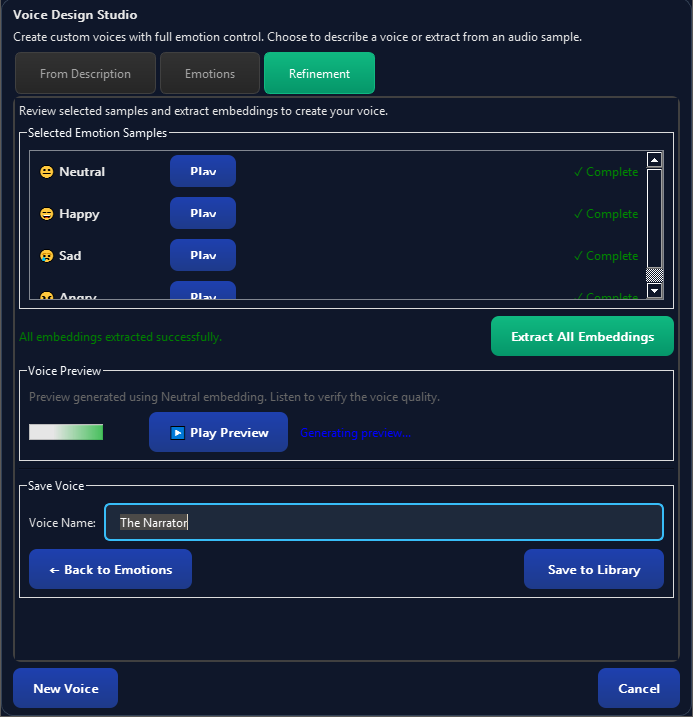
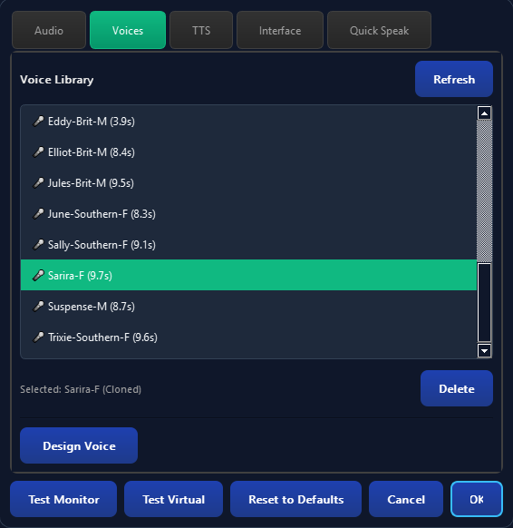
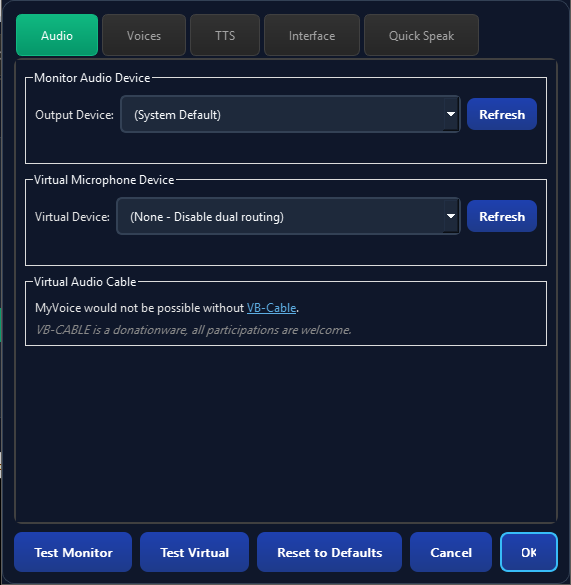
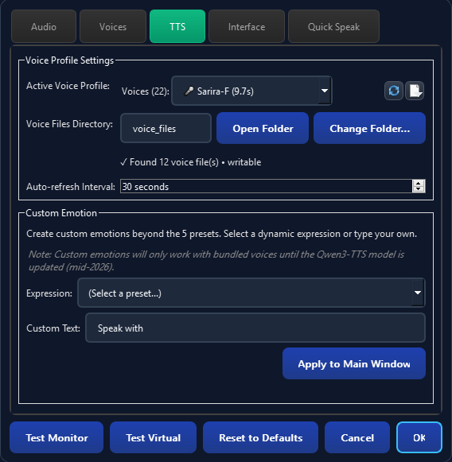
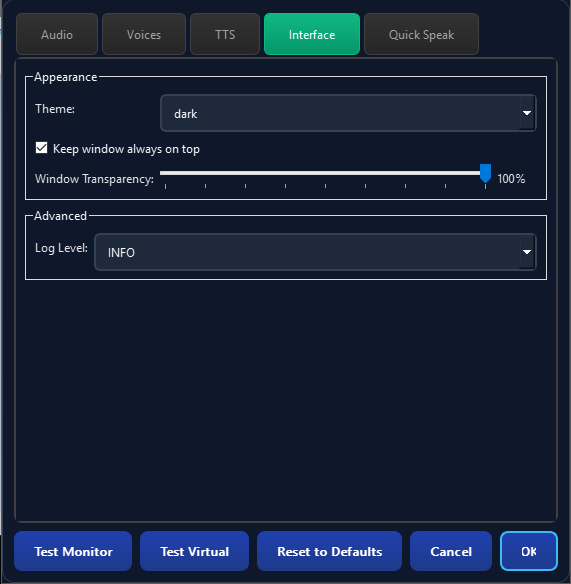
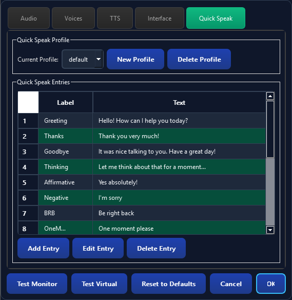

# MyVoice V2 - Expressive Voice Communication for Everyone

MyVoice is a Windows desktop application that enables mute individuals and content creators to communicate in voice chats using emotionally expressive text-to-speech. Powered by embedded Qwen3-TTS technology, it works fully offline with no external service dependencies.

## Screenshots

<p align="center">
  
  <br/><em>Compact main window with emotion controls and voice selection</em>
</p>

<details>
<summary><strong>Click to view more screenshots</strong></summary>

### Voice Design Studio
| Imagine Your Voice | Emotion Samples | Voice Refinement |
|:------------------:|:---------------:|:----------------:|
|  |  |  |

### Settings
| Voices | Audio | TTS | Interface | Quick Speak |
|:------:|:-----:|:---:|:---------:|:-----------:|
|  |  |  |  |  |

</details>

## What's New in V2

- **Embedded Qwen3-TTS** - No external service required, works completely offline
- **Emotion Control** - 5 presets (Neutral, Happy, Sad, Angry, Flirtatious) + custom prompts
- **Voice Design** - Create unique voices from text descriptions
- **Improved Voice Cloning** - Clone voices from just 3 seconds of audio
- **9 Bundled Voices** - Ready to use out of the box with full emotion support
- **Quick Speak** - Save and trigger common phrases instantly
- **Streaming TTS** - First audio in under 2 seconds

## Features

- **Emotion Presets**: Express yourself with 5 emotion buttons (F1-F5 shortcuts) or custom emotion prompts
- **Voice Design**: Describe a voice in text ("elderly male, gravelly, speaks slowly") and create it
- **Voice Cloning**: Clone any voice from a 3-second audio sample (WAV/MP3/M4A)
- **9 Bundled Voices**: Pre-trained timbres (Vivian, Serena, Dylan, Eric, Ryan, Aiden, and more) with full emotion support
- **Dual Audio Output**: Simultaneous playback to monitor speakers AND virtual microphone
- **Quick Speak**: Configure common phrases for instant generation
- **Virtual Microphone**: Route speech directly to Discord, Zoom, Teams, and other apps
- **Audio Transcription**: Automatic transcription using OpenAI Whisper
- **Always-On-Top Window**: Compact 400x188px interface stays visible during voice chats
- **Fully Offline**: After initial setup, no internet connection required

## System Requirements

- **Operating System**: Windows 10 (1903+) or Windows 11 (64-bit)
- **Memory**: 16GB RAM recommended (8GB minimum - may experience slower model switching)
- **Storage**: 8GB free space
  - Installation: ~2GB
  - Qwen3-TTS models: ~3.4GB each (downloaded on first use, one model loaded at a time)
  - Whisper models: ~1-3GB (downloaded on first use)
- **Processor**: CPU-only supported (GPU optional for faster inference)
- **Audio**: Audio output device required

### Virtual Microphone Software (Required for Voice Chat)

Choose ONE of the following:

- **VB-Audio Cable** (Simple - Recommended for beginners)
  - Download: https://download.vb-audio.com/Download_CABLE/VBCABLE_Driver_Pack45.zip

- **VoiceMeeter Banana** (Advanced - Full audio routing control)
  - Download: https://download.vb-audio.com/Download_CABLE/VoicemeeterSetup_v2119.zip

### Additional Requirements

- **Microsoft Visual C++ Redistributable** (usually pre-installed)
  - Download: https://aka.ms/vs/17/release/vc_redist.x64.exe


## Quick Start

### Bundled Installation (Recommended)

This package includes a pre-configured Python 3.10 environment. No Python installation required!

1. **Install Dependencies**
   - Double-click `00_Install_Dependencies.bat`
   - Wait for installation to complete (may take 5-10 minutes)
   - Downloads include:
     - Python packages: PyTorch, Whisper, Qwen3-TTS, PyQt6 (~2GB)
     - Voice cloning models download on first use (~3.4GB)

2. **Run MyVoice**
   - Double-click `01_Run_MyVoice.bat`
   - MyVoice application window will open

### Manual Installation (Advanced Users)

If you have Python 3.10+ installed:

```bash
# Create virtual environment
python -m venv .venv

# Activate environment
.venv\Scripts\activate

# Install dependencies
pip install -r requirements.txt

# Run application
python -m myvoice.main
```

## First Time Setup

1. **Launch MyVoice**
   - A bundled voice is pre-selected - you can start speaking immediately!

2. **Configure Audio Devices** (Settings → Audio)
   - **Monitor Speaker**: Select your headphones/speakers for self-monitoring
   - **Virtual Microphone**: Select "CABLE Input" (VB-Audio) or "VoiceMeeter Input"

3. **Configure Your Communication App**
   - In Discord/Zoom/Teams: Set input device to "CABLE Output" or "VoiceMeeter Output"
   - Test by generating speech - it should be heard in your voice chat

## Usage

### Basic Text-to-Speech

1. Type your message in the text input field
2. Select an emotion preset (😐😄😢😠😏) or use F1-F5 shortcuts
3. Click **Generate** or press Enter
4. Audio plays through both your speakers and the virtual microphone

### Voice Types

MyVoice V2 offers three ways to create voices:

| Type | How to Create | Emotion Support | Best For |
|------|---------------|-----------------|----------|
| **Bundled** 📦 | Pre-installed (9 voices) | ✅ Full | Quick start, reliable quality |
| **Designed** 🎭 | Text description | ✅ Full | Custom characters, unique voices |
| **Cloned** 🎤 | 3-sec audio sample | ❌ None | Identity preservation |

> **Note**: Cloned voices preserve vocal identity but do NOT support emotion control. For expressive communication with a custom voice, use Voice Design.

### Voice Design (Creating Voices from Text)

1. Open Settings → Voices → **Design Voice**
2. Enter a description: "Young female, warm tone, slight British accent, speaks confidently"
3. Click **Preview** to hear the voice
4. Adjust description and preview until satisfied
5. Click **Save** to add to your voice library

**Emotion Samples**: After creating a designed voice, you can generate emotion samples to give your voice more dynamic range. This allows the voice to express different emotions more naturally during conversations.

### Voice Cloning (Preserving Your Identity)

1. Open Settings → Voices → **Clone Voice**
2. Select a WAV, MP3, or M4A file (minimum 3 seconds of clear speech)
3. Click **Extract Embedding** to process
4. Preview the cloned voice
5. Click **Save Voice** to add to your library

### Quick Speak (Common Phrases)

1. Open Settings → Quick Speak
2. Add frequently used phrases ("Hello!", "Be right back", "Good game!")
3. Click the 📄 button in the main window to access your phrases
4. Select a phrase - it generates immediately

### Emotion Control

- **Presets**: Click emoji buttons or use F1-F5 shortcuts
  - F1: 😐 Neutral
  - F2: 😄 Happy
  - F3: 😢 Sad
  - F4: 😠 Angry
  - F5: 😏 Flirtatious
- **Custom**: Settings → TTS → Custom Emotion for freeform emotion prompts
- **Note**: Emotions only work with Bundled and Designed voices (not Cloned)

### Playback Controls

- **Replay** 🔄: Replay the last generated audio instantly
- **Clear** 🗑️: Clear the text input field

## Troubleshooting

### Installation Issues

**PyAudio Installation Fails**
- Install Microsoft Visual C++ Build Tools
- Download from: https://visualstudio.microsoft.com/visual-cpp-build-tools/

**PyTorch Installation Slow**
- PyTorch is ~2GB download
- Ensure stable internet connection
- Installation may take 5-10 minutes

**Permission Errors**
- Run installation as Administrator
- Check antivirus isn't blocking

### Model Loading Issues

**"Loading voice model..." takes too long**
- First load downloads ~3.4GB model (requires internet)
- Subsequent loads are faster (30 seconds typical)
- Ensure 16GB RAM available for smooth operation

**Model loading fails**
- Check disk space (need ~8GB free)
- Check `logs/myvoice.log` for specific errors
- Try restarting the application

### Audio Issues

**No Audio Output**
- Verify audio device selection in Settings → Audio
- Check Windows audio settings
- Ensure device isn't in use exclusively by another app

**Virtual Microphone Not Working**
- Verify VB-Audio Cable or VoiceMeeter is installed
- In Settings → Audio, select "CABLE Input" as Virtual Mic
- In your voice chat app, select "CABLE Output" as input device
- Use "Test Virtual" button to verify routing

**Audio Stuttering or Gaps**
- Close other audio-intensive applications
- Check CPU usage - TTS is computationally intensive
- Try reducing system audio quality to 48kHz

**Device Disconnected**
- MyVoice auto-recovers when devices reconnect
- If issues persist, open Settings → Audio to refresh device list

### Voice Issues

**Emotion Buttons Are Grayed Out**
- This is expected for Cloned voices (Base model limitation)
- Switch to a Bundled or Designed voice for emotion support

**Cloned Voice Doesn't Sound Right**
- Use a clear, noise-free audio sample
- Sample should be 3-10 seconds of natural speech
- Avoid samples with music or background noise

**Voice Design Preview Sounds Wrong**
- Try more specific descriptions
- Include age, gender, accent, speaking style
- Example: "Middle-aged male, deep voice, speaks slowly, calm demeanor"

### Application Issues

**Application Won't Start**
- Check `logs/myvoice.log` for errors
- Ensure all dependencies installed
- Verify Python 3.10+ in `.venv` (if manually installed)

**Settings Not Saving**
- Check write permissions on `%LOCALAPPDATA%\MyVoice\`
- Try running as Administrator once to create directories

**Transcription Fails**
- Whisper downloads models on first use (requires internet)
- Ensure microphone permissions granted in Windows Settings

## Project Structure

```
MyVoice/
├── python310/                  # Bundled Python 3.10 environment
├── src/
│   └── myvoice/                # Application source code
│       ├── main.py             # Entry point
│       ├── app.py              # Application controller
│       ├── ui/                 # User interface components
│       │   ├── components/     # Reusable UI widgets
│       │   └── dialogs/        # Dialog windows
│       ├── services/           # Business logic services
│       │   ├── qwen_tts_service.py      # Qwen3-TTS integration
│       │   ├── audio_coordinator.py     # Dual audio routing
│       │   ├── voice_profile_service.py # Voice library management
│       │   └── ...             # 25+ service modules
│       ├── models/             # Data models
│       └── utils/              # Utility functions
├── voice_files/                # Voice samples and embeddings
│   ├── embeddings/             # Saved voice embeddings
│   └── design_sessions/        # Voice Design working files
├── logs/                       # Application logs
├── docs/                       # Documentation and stories
├── build_tools/                # Installer and build scripts
├── requirements.txt            # Python dependencies
├── setup.py                    # Package configuration
├── 00_Install_Dependencies.bat # Dependency installer
├── 01_Run_MyVoice.bat          # Application launcher
└── README.md                   # This file
```

## Dependencies

### Core Dependencies
- **PyQt6** (≥6.6.0) - GUI framework
- **torch** (≥2.0.0) - Machine learning framework (Qwen3-TTS inference)
- **transformers** - Hugging Face model loading
- **openai-whisper** (≥20231117) - Speech recognition
- **pyaudio** (≥0.2.13) - Audio I/O
- **numpy** (≥1.24.0) - Numerical processing
- **soundfile** - Audio file handling

### Development Dependencies
- **pytest** (≥7.4.0) - Testing framework
- **pytest-qt** (≥4.2.0) - PyQt testing
- **pytest-asyncio** (≥0.21.0) - Async testing

## Configuration

Application settings stored in:
- **Windows**: `%LOCALAPPDATA%\MyVoice\settings.json`

Voice library stored in:
- **Windows**: `%LOCALAPPDATA%\MyVoice\voices\`

## Logs

Application logs written to:
- **Location**: `logs/myvoice.log`
- **Rotation**: Automatic when file exceeds size limit

## Support

### Common Questions

**Q: Does this work with any communication app?**
A: Yes! Any app that accepts virtual audio devices works - Discord, Zoom, Teams, Skype, OBS, and more.

**Q: What's the difference between Voice Design and Voice Cloning?**
A:
- **Voice Design**: Create a voice from a text description. Supports emotion control.
- **Voice Cloning**: Copy a voice from an audio sample. Preserves identity but no emotion control.

**Q: Why can't I use emotions with my cloned voice?**
A: The Qwen3-TTS Base model (used for cloning) doesn't support the emotion instruction parameter. This is a model limitation, not a bug. Use Bundled or Designed voices for emotional expression.

> **Coming Soon**: Qwen3-TTS has announced a model update planned for mid-2026 that will enable detailed emotion control with cloned voices. Stay tuned!

**Q: Can I use my own audio samples for cloning?**
A: Yes! WAV, MP3, or M4A formats. Minimum 3 seconds of clear speech recommended.

**Q: How much disk space do I need?**
A: ~8GB total: Installation (~2GB) + one Qwen3-TTS model (~3.4GB) + Whisper (~1-3GB). Only one TTS model loads at a time.

**Q: Does this work offline?**
A: Yes! After initial model downloads, everything works fully offline. No internet required for daily use.

**Q: How do I get the best voice clone quality?**
A: Use a clean audio sample (no background noise/music), 3-10 seconds of natural speech, recorded at reasonable quality.

**Q: Can I create multiple custom voices?**
A: Yes! Create as many Designed and Cloned voices as you want. They're saved in your voice library.

## License

See LICENSE file for details.

## Credits

- **Qwen3-TTS**: Text-to-speech models (Base, CustomVoice, VoiceDesign)
- **OpenAI Whisper**: Speech recognition and transcription
- **PyQt6**: Cross-platform GUI framework

### Special Thanks

MyVoice would not be possible without **VB-Cable** by VB-Audio. Their virtual audio cable software enables the voice chat integration that makes this application useful for real-time communication.

**Please show some love to VB-Audio as well!** VB-Cable is donationware - if you find MyVoice helpful, consider supporting the developers who made the underlying audio routing possible:

🎧 **[Support VB-Audio (VB-Cable)](https://shop.vb-audio.com/en/win-apps/11-vb-cable.html)**

## Version

Current version: **2.0.0**
---